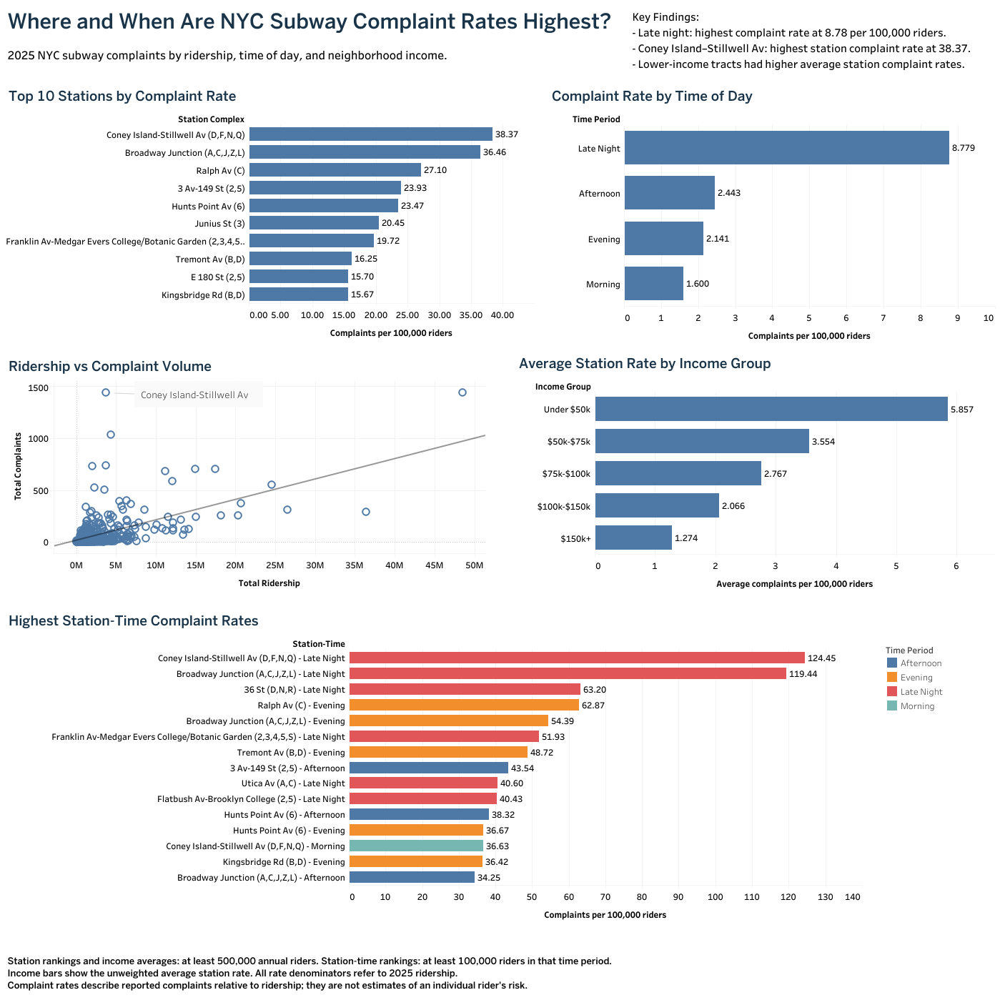

# NYC Subway Complaint & Ridership Analysis

### Identifying where and when reported subway complaints are disproportionately concentrated after accounting for ridership

**SQL · Python · GeoPandas · Tableau**

---

## Dashboard



**Interactive Tableau Dashboard:** [View on Tableau Public](https://public.tableau.com/app/profile/ethan.sangiovanni4304/viz/NYC_Subway_Dashboard_Final/NYCSubwayComplaintsRidershipandNeighborhoodIncome2025)

**Tableau workbook:** [NYC_Subway_Dashboard_Final.twb](tableau/NYC_Subway_Dashboard_Final.twb)

---

## Business Problem

A subway station with a high number of reported complaints is not necessarily unusually problematic—it may simply serve far more passengers than other stations.

For transit safety and operations teams working with limited resources, relying only on raw complaint totals could direct attention toward the busiest stations while overlooking lower-volume stations where complaints occur disproportionately often.

This project builds a **decision-support framework for identifying which stations and time periods warrant closer operational review** by evaluating reported complaints relative to passenger exposure.

### Decision Question

> **If transit safety resources are limited, which station and time-period combinations should receive closer attention based on both complaint volume and ridership-adjusted complaint rates?**

The analysis also explores whether station-area median household income is associated with complaint patterns. Income is treated as a **contextual variable rather than a basis for resource-allocation decisions**.

---

## Executive Summary

The analysis combines:

- **33,691 NYPD subway complaints**
- **3,628,476 MTA hourly ridership records**
- **424 MTA station complexes**
- **2024 ACS Census-tract median household income estimates**

to compare complaint patterns across NYC subway stations during 2025.

### Key Findings

- **Ridership explains some—but not all—variation in complaint volume.** Station ridership had a moderate positive association with raw complaints (`Pearson r = 0.562`), but almost no relationship with complaints per 100,000 riders (`r = -0.087`).

- **Raw complaint rankings and rider-adjusted rankings tell different stories.** Times Square and Coney Island-Stillwell recorded nearly the same number of complaints despite Times Square serving roughly 13 times as many riders.

- **Late Night had the highest systemwide rider-adjusted complaint rate.** The Late Night rate was **8.78 complaints per 100,000 riders**, approximately 3.6× the Afternoon rate and 5.5× the Morning rate.

- **Coney Island-Stillwell Av and Broadway Junction repeatedly stood out** after adjusting for ridership and when examining station-by-time-period combinations.

- **Station-area Census-tract income showed a negative association with rider-adjusted complaint rates**, but this finding is exploratory and does not establish causation.

### Analytical Conclusion

> **The strongest evidence supports prioritizing further investigation toward station-and-time combinations that remain elevated after accounting for passenger exposure—particularly during Late Night hours—rather than allocating attention based on raw complaint totals alone.**

This analysis identifies **where deeper operational investigation may be most valuable**. It does not prescribe specific policing or staffing levels.

---

## How the Analysis Supports Decisions

Complaint volume and complaint rate answer different operational questions.

| Complaint Volume | Rider-Adjusted Rate | Interpretation | Potential Use |
|---|---|---|---|
| High | High | Large complaint count and disproportionately high rate | **Strongest candidate for deeper operational review** |
| High | Lower | High complaint count may partly reflect passenger exposure | Monitor, but avoid treating raw volume alone as unusual |
| Lower | High | Fewer complaints but unusually high relative to ridership | Investigate station-specific factors |
| Lower | Lower | Lower relative concentration on both measures | Lower comparative priority |

Time of day adds another dimension. A station that is elevated overall **and** particularly elevated during a specific period can be investigated more precisely than one identified only through annual totals.

The analysis therefore functions as a **screening and prioritization tool**, not an automatic decision rule.

---

## Data

### NYPD Complaint Data

After filtering to 2025 subway complaints with usable station information:

- **33,691 reported complaints**
- **366 distinct NYPD station names**

Relevant fields included:

- complaint date and time
- subway station name
- latitude and longitude
- offense classification
- transit district
- complaint severity/category

**Source:** [NYC Open Data — NYPD Complaint Data Historic](https://data.cityofnewyork.us/Public-Safety/NYPD-Complaint-Data-Historic/qgea-i56i)

---

### MTA Hourly Subway Ridership

After filtering to 2025:

- **3,628,476 hourly records**
- **424 station complexes**

The analysis uses `station_complex_id` as the primary MTA station identifier.

Hourly ridership was aggregated by station and time period to create passenger-exposure denominators.

**Source:** [MTA Subway Hourly Ridership: Beginning 2025](https://data.ny.gov/Transportation/MTA-Subway-Hourly-Ridership-Beginning-2025/5wq4-mkjj)  
**Dataset ID:** `5wq4-mkjj`

---

### Census Income

Station-area economic context was measured using:

**[U.S. Census Bureau — 2024 American Community Survey 5-Year Estimates, Table B19013](https://data.census.gov/table/ACSDT5Y2024.B19013)**

`ACSDT5Y2024.B19013`

**Tract boundaries:** [2024 New York TIGER/Line Census tract shapefile](https://www2.census.gov/geo/tiger/TIGER2024/TRACT/tl_2024_36_tract.zip)

The measure represents **median household income for the Census tract containing each station complex**.

It does **not** represent the income of subway riders, victims, offenders, or station employees.

Because Census tracts are statistical geographic areas rather than neighborhoods, this project refers to the measure as **station-area or Census-tract income** rather than treating it as a precise neighborhood measure.

---

## Technical Approach

### 1. Data Cleaning and Validation

SQL was used to:

- validate imported row counts and date ranges
- check missing station information
- identify MTA ridership values stored incorrectly as text
- remove thousands separators and convert ridership to integers
- validate station identifiers and coordinates
- check duplicate station-hour records
- aggregate complaint and ridership totals
- create rider-adjusted metrics

The raw MTA table was preserved while a cleaned `mta_ridership_clean` table was created for analysis.

Validation was performed throughout the workflow rather than only after the final dashboard was built.

---

### 2. Cross-Dataset Station Matching

#### The Challenge

NYPD and MTA station names do not use a common naming convention.

The same subway complex may be represented differently across datasets, and some station names can refer to multiple physical locations.

A direct text join would therefore create incorrect or missing matches.

#### Matching Approach

NYPD complaints were grouped into **911 station-coordinate clusters** using station name and rounded geographic coordinates.

Each cluster was compared with MTA station-complex locations.

The matching process incorporated:

1. normalized station names
2. geographic distance
3. MTA station coordinates
4. previously validated station-name mappings
5. NYPD transit district information
6. manual review of ambiguous and high-volume cases

SQL window functions were used to rank MTA candidates for each NYPD coordinate cluster.

Ambiguous records were intentionally left unmatched instead of forcing uncertain assignments.

#### Final Matching Coverage

**33,309 of 33,691 complaints were successfully mapped to an MTA station complex.**

**Coverage: approximately 98.9%**

This crosswalk made it possible to compare NYPD complaints with MTA ridership using a common station identifier.

---

### 3. Census Spatial Join

Python and GeoPandas were used to connect subway stations with Census income data.

The workflow:

1. loaded the 424 unique MTA station locations
2. converted station latitude/longitude into geographic points
3. loaded 2024 New York Census tract boundaries
4. converted both datasets to the same coordinate reference system
5. spatially joined each station point to the tract containing it
6. merged ACS median household income onto the resulting station-tract mapping

All **424 station complexes received a Census tract assignment**.

Fourteen stations did not have a usable median household income estimate in the ACS source and were excluded from income-specific analysis.

---

### 4. Rider-Adjusted Complaint Rate

Raw complaint totals were normalized by passenger exposure using:

```text
Complaints per 100,000 riders
=
(Reported Complaints / Ridership) × 100,000
```

This metric is intended for **relative station comparison**.

It should not be interpreted as an individual's probability of becoming a crime victim.

#### Minimum-Ridership Thresholds

Very small denominators can produce unstable rates.

To reduce this problem:

- annual station rankings require at least **500,000 annual riders**
- station/time-period rankings require at least **100,000 riders within that period**

The annual threshold excludes only **25 of 424 station complexes**.

---

### 5. Time-of-Day Analysis

Complaint and ridership records were grouped into four consistent periods:

| Period | Hours |
|---|---|
| Morning | 6:00 AM–11:59 AM |
| Afternoon | 12:00 PM–4:59 PM |
| Evening | 5:00 PM–9:59 PM |
| Late Night | 10:00 PM–5:59 AM |

NYPD complaint timestamps were already stored using a 24-hour format.

MTA timestamps were converted from 12-hour AM/PM values into 24-hour hours before assigning the same four time periods.

Complaint counts and ridership were aggregated independently before calculating rider-adjusted rates.

---

### 6. Statistical Analysis

Python was used to evaluate relationships between variables using:

- **Pearson correlation** — linear association
- **Spearman correlation** — rank-based monotonic association
- **linear regression residuals** — identification of stations with rates unusually high or low relative to broader relationships

Ridership was log-transformed for the ridership residual analysis because station ridership is strongly skewed.

Using both raw totals and normalized rates helped distinguish **high-volume stations** from **disproportionately high-rate stations**.

---

## Results

### 1. Raw Complaint Volume Does Not Tell the Full Story

Stations with the highest raw complaint totals included:

| Station | Reported Complaints |
|---|---:|
| Times Sq-42 St / Port Authority | **1,443** |
| Coney Island-Stillwell Av | **1,437** |
| 3 Av-149 St | **1,035** |

Times Square and Coney Island-Stillwell had nearly identical complaint totals.

Their ridership, however, was dramatically different:

- **Times Square:** approximately 48.5 million riders
- **Coney Island-Stillwell:** approximately 3.7 million riders

After accounting for passenger volume, their relative positions changed substantially.

#### Highest Rider-Adjusted Rates
*Stations with at least 500,000 annual riders*

| Station | Complaints per 100k Riders |
|---|---:|
| Coney Island-Stillwell Av | **38.37** |
| Broadway Junction | **36.46** |
| Ralph Av | **27.10** |
| 3 Av-149 St | **23.93** |
| Hunts Point Av | **23.47** |

This difference between the raw and adjusted rankings is a central reason the project evaluates both measures.

---

### 2. Ridership Was Related to Complaint Volume—but Not Complaint Rate

#### Ridership vs. Raw Complaints

```text
Pearson r  = 0.562
Spearman ρ = 0.532
```

This indicates a **moderate positive association**: busier stations generally recorded more complaints.

#### Ridership vs. Complaints per 100,000 Riders

```text
Pearson r  = -0.087
Spearman ρ = -0.169
```

After accounting for passenger exposure, the relationship largely disappeared.

Higher passenger volume was therefore associated with a greater **number** of complaints, but not necessarily a greater **rider-adjusted complaint rate**.

---

### 3. Late Night Had the Highest Rider-Adjusted Complaint Rate

| Time Period | Complaints | Riders | Complaints per 100k Riders |
|---|---:|---:|---:|
| Morning | 6,640 | 415,027,109 | 1.60 |
| Afternoon | 9,931 | 406,476,845 | 2.44 |
| Evening | 7,983 | 372,937,037 | 2.14 |
| Late Night | 9,137 | 104,075,041 | **8.78** |

Afternoon recorded the most complaints in absolute terms.

Late Night, however, recorded by far the highest rate relative to ridership.

The Late Night rate was approximately:

- **3.6×** the Afternoon rate
- **5.5×** the Morning rate

This shows why time of day is an important dimension for operational review.

---

### 4. The Highest Station-Time Rates Were Concentrated in Late Night Periods

Combining station and time of day revealed more specific concentrations.

*Station-time combinations shown below each have at least 100,000 riders during the period.*

| Station | Period | Complaints per 100k Riders |
|---|---|---:|
| Coney Island-Stillwell Av | Late Night | **124.45** |
| Broadway Junction | Late Night | **119.44** |
| 36 St (D,N,R) | Late Night | **63.20** |
| Ralph Av | Evening | **62.87** |
| Broadway Junction | Evening | **54.39** |
| Franklin Av-Medgar Evers/Botanic Garden | Late Night | **51.93** |

Late Night appears repeatedly among the highest station-time combinations.

Rather than identifying only a "high complaint" station, this analysis shows **both where and when elevated rider-adjusted rates are concentrated**.

---

### 5. Several Stations Remained Consistent Outliers

Residual analysis identified stations whose complaint rates were substantially higher than broader systemwide relationships would predict.

Recurring positive outliers included:

- Coney Island-Stillwell Av
- Broadway Junction
- Ralph Av
- 3 Av-149 St
- Hunts Point Av

Coney Island-Stillwell and Broadway Junction were especially notable because they appeared across multiple analytical views rather than only a single ranking.

These stations are therefore stronger candidates for **additional station-level investigation** than stations appearing high under only one measure.

---

### 6. Exploratory Finding: Station-Area Income

Median household income was included as a **secondary contextual analysis**, not as a direct resource-allocation variable.

For eligible stations:

```text
Pearson r  = -0.295
Spearman ρ = -0.434
```

Higher-income Census tracts generally tended to have lower rider-adjusted complaint rates.

Grouped station averages showed the same pattern:

| Census-Tract Median Household Income | Avg. Complaints per 100k Riders |
|---|---:|
| Under $50k | **5.86** |
| $50k–$75k | 3.55 |
| $75k–$100k | 2.77 |
| $100k–$150k | 2.07 |
| $150k+ | **1.27** |

#### Important Interpretation

This relationship is **associative, not causal**.

Income may correlate with many other factors not included in the project, including station characteristics, surrounding land use, service patterns, enforcement practices, passenger mix, and other local conditions.

For that reason, **income is not used to determine which stations should receive additional safety resources**.

Its purpose is to test whether broader geographic context is associated with the station-level patterns observed elsewhere in the analysis.

---

## Recommendation

The analysis does not support a simple recommendation such as assigning resources to whichever stations record the most complaints.

Instead, it supports a more targeted decision framework:

> **Prioritize further investigation toward stations that consistently rank highly in both total complaints and rider-adjusted complaint rates, particularly during the time periods in which elevated rates are concentrated.**

Based on the 2025 analysis, **Coney Island-Stillwell Av and Broadway Junction** are strong examples of stations warranting closer operational review because they remain elevated across multiple measures.

Late Night periods also deserve particular attention because their systemwide rider-adjusted complaint rate was substantially higher than other periods.

Before implementing a specific intervention, decision-makers would need additional information such as offense type, station layout, staffing, enforcement activity, service patterns, and other station-specific conditions.

The project therefore identifies **where deeper investigation should begin**, rather than claiming that the available data alone can determine the correct intervention.

---

## Technical Skills Demonstrated

### SQL / SQLite

- data validation and cleaning
- multi-table joins
- CTEs
- window functions
- conditional logic
- station-level aggregation
- time bucketing
- rate calculations
- cross-dataset entity resolution
- geographic-distance validation
- manual match-review workflows

### Python

- pandas
- GeoPandas
- NumPy
- SciPy
- **geospatial station-to-Census-tract matching**
- data cleaning
- Pearson and Spearman correlation
- linear regression
- residual analysis
- outlier identification
- analytical validation

### Tableau

- KPI design
- calculated fields
- filtering
- scatter plots
- station rankings
- time-of-day comparisons
- dashboard design
- analytical storytelling

---

## Data Quality and Validation

The workflow included multiple checks before results were accepted:

- row-count validation after filters, joins, and table creation
- minimum and maximum date checks
- null-value checks
- duplicate checks
- distinct station counts
- MTA station identifier validation
- coordinate consistency checks
- geographic-distance validation
- manual review of high-volume and ambiguous station matches
- comparison of aggregate totals between intermediate datasets
- consistency checks between SQL, Python, and Tableau outputs

Uncertain station mappings were intentionally excluded rather than forced into the analytical dataset.

---

## Limitations

- NYPD records measure **reported complaints**, not every incident that occurred.

- Complaints per 100,000 riders is an **exposure-adjusted comparison metric**, not an estimate of individual victimization probability.

- MTA ridership represents estimated station entries. It does not measure each passenger's total time spent in the system or every transfer movement.

- Approximately **1.1% of complaints** could not be confidently mapped to an MTA station complex.

- Complaint times may not perfectly represent the exact moment every underlying incident occurred.

- Census income describes the tract containing the station, not the socioeconomic characteristics of individual riders, victims, or offenders.

- A station point assigned to a Census tract cannot fully represent the social or economic characteristics of the larger area surrounding a station complex.

- Correlations, regression residuals, and grouped comparisons identify patterns and associations; they **do not establish causation**.

- Minimum-ridership thresholds reduce instability from small denominators but exclude some low-ridership observations.

- Income-group averages are unweighted averages across eligible stations.

- The analysis covers one calendar year, so some station patterns may reflect 2025-specific conditions rather than persistent long-term differences.

---

## Repository Structure

```text
NYC-Subway-Complaint-Analysis/
│
├── .gitattributes
├── .gitignore
├── README.md
├── requirements.txt
│
├── sql/
│   ├── 01_data_validation.sql
│   ├── 02_mta_cleaning.sql
│   ├── 03_station_matching.sql
│   ├── 04_station_manual_review.sql
│   ├── 05_low_volume_matching.sql
│   ├── 06_final_station_crosswalk.sql
│   ├── 07_census_integration.sql
│   ├── 08_station_analysis.sql
│   ├── 09_time_analysis.sql
│   └── 10_tableau_exports.sql
│
├── python/
│   ├── 01_census_to_mta.py
│   └── 02_statistical_analysis.py
│
├── data/
│   ├── final_station_crosswalk.csv
│   ├── income_complaint_rate_analysis.csv
│   ├── mta_station_locations.csv
│   ├── ridership_complaint_correlation.csv
│   ├── ridership_complaint_rate_analysis.csv
│   ├── station_income.csv
│   ├── tableau_station_summary.csv
│   ├── tableau_station_time.csv
│   └── tableau_time_summary.csv
│
├── tableau/
│   └── NYC_Subway_Dashboard_Final.twb
│
└── images/
    └── dashboard.png
```

Large raw government datasets are not stored in the repository. The `data/` directory contains smaller analytical outputs needed to reproduce or inspect the analysis.

---

## Reproducing the Analysis

Clone or download this repository, then run `python -m pip install -r requirements.txt` from the repository root. Download the original government datasets separately using the official links above.

Large raw NYPD, MTA, and Census datasets are intentionally excluded from the repository. Create a local, git-ignored `raw_data/` folder. Save the ACS 2024 5-Year B19013 CSV for the relevant Census tracts as `raw_data/Census data.csv`, retaining the `GEO_ID`, `NAME`, and `B19013_001E` columns. Extract the TIGER/Line archive into the same folder so `raw_data/tl_2024_36_tract.shp` and its companion files remain together. The spatial-join script reads the provided `data/mta_station_locations.csv`.

Follow this order:

1. Import the NYPD and MTA source extracts into SQLite as `nypd_complaints` and `mta_ridership` **before running any SQL**. Use the project's documented 2025 scope and the columns and formats expected by `sql/01_data_validation.sql`, including the MTA station-hour aggregation and `sum_ridership` field.
2. Run SQL scripts **01 through 06** in numerical order, following their validation and manual-review steps.
3. From the repository root, run `python python/01_census_to_mta.py`. This performs the Census spatial join and writes `data/station_income.csv`.
4. Import `data/station_income.csv` into the same SQLite database as `station_income`.
5. Import the Census ACS income CSV into SQLite as `census_income`. **Both `station_income` and `census_income` must exist before `sql/07_census_integration.sql` runs.**
6. Continue with SQL scripts **07 through 10** in numerical order. Export the resulting `ridership_complaint_correlation`, `ridership_complaint_rate_analysis`, `income_complaint_rate_analysis`, `tableau_station_summary`, `tableau_station_time`, and `tableau_time_summary` tables as matching CSV filenames in `data/`, with column headers.
7. Run `python python/02_statistical_analysis.py` to read the analytical CSVs and print the statistical results.
8. Use the analytical CSV outputs and `tableau/NYC_Subway_Dashboard_Final.twb` for final inspection and visualization, reconnecting Tableau to the local CSVs as needed. The provided cleaned CSVs and Tableau Public dashboard can also be used to inspect the existing results.

This is a reproducible workflow with manual imports, review steps, and exports—not a one-command pipeline. The SQL scripts create and query SQLite tables; they do not automatically write CSV files.

---

## Future Analysis

The most valuable extensions would be:

1. **Offense type and severity**  
   Determine whether high-rate stations experience the same types of complaints or fundamentally different safety issues.

2. **Station characteristics**  
   Add variables such as number of entrances/exits, transfer complexity, or physical station characteristics to test whether they help explain differences among stations with similar ridership.

3. **Multi-year validation**  
   Repeat the analysis across multiple years to distinguish persistent station patterns from one-year anomalies.

These extensions would move the project from identifying **where and when** unusual complaint concentrations occur toward better understanding **why** they occur and what additional operational investigation may be appropriate.

---

## Development Note

Generative AI was used as a learning, debugging, and documentation assistant during portions of the project.

All project data came from public government sources, and analytical outputs were validated through SQL queries, Python results, row-count checks, manual station-match review, and cross-checks between analytical tools.

---

## Project Takeaway

This project demonstrates an end-to-end analytics workflow:

**business problem → data cleaning → cross-dataset entity resolution → geospatial integration → KPI design → statistical analysis → visualization → decision support**

The central lesson is that **the highest raw complaint totals are not necessarily the locations with the highest complaint concentration relative to passenger exposure**.

By combining rider-adjusted rates with time-of-day analysis, the project provides a more useful framework for identifying **where and when limited transit-safety resources may warrant closer attention**.
